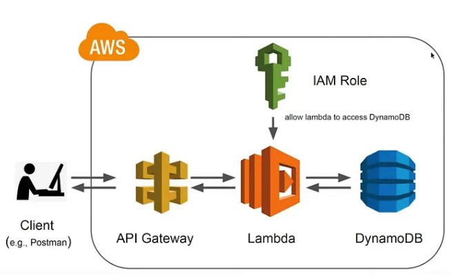

# AWS CDK Python Rest API Lambda DynamoDB

This project demonstrates how to create a REST API using AWS CDK, which integrates with AWS Lambda and DynamoDB.

## Prerequisites

- AWS Account
- AWS CLI installed and configured
- AWS CDK installed and configured

## Architecture

<pre>
git clone thisrepo
cd thisrepo
python -m venv .venv
source .venv/bin/activate
pip install -r requirements.txt
cdk bootstrap
cdk deploy
</pre>